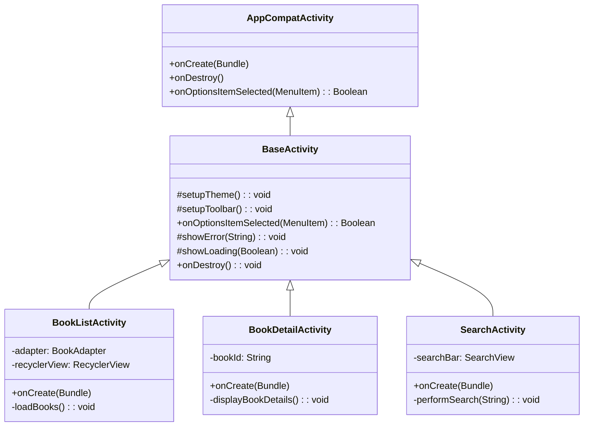

# BookBrow Mobile - Base Kotlin UML Diagram

## Class Hierarchy

## Class Details

### BaseActivity
The foundation class for all activities in the BookBrow application.

**Responsibilities:**
- Common toolbar setup and styling
- Theme management
- Lifecycle management
- Error and loading state handling

**Key Methods:**
- `setupTheme()`: Initialize theme settings
- `setupToolbar()`: Configure action bar
- `showError(message)`: Display error messages
- `showLoading(isLoading)`: Show/hide loading state

**Subclasses:**
- `BookListActivity`: Displays list of books
- `BookDetailActivity`: Shows individual book details
- `SearchActivity`: Handles book search functionality

## Architecture Pattern

This implementation follows the **Template Method Pattern**, where:
- `BaseActivity` defines the structure and common behavior
- Subclasses override specific methods to customize behavior
- Each activity inherits common functionality automatically

## Benefits

1. **Code Reusability**: Common functionality shared across all activities
2. **Consistency**: All screens maintain the same look and feel
3. **Maintainability**: Changes to common behavior made in one place
4. **Extensibility**: Easy to add new activities with predefined structure
